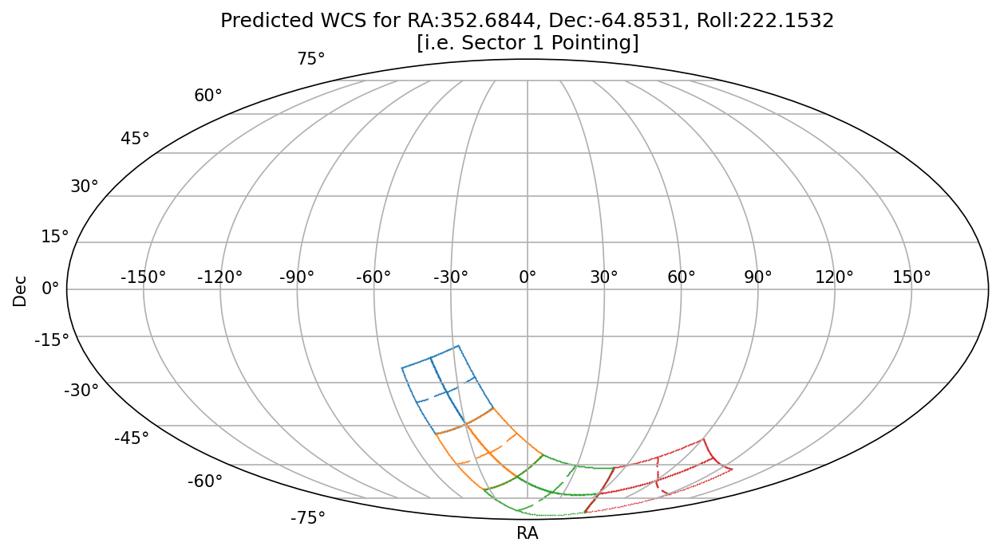

<a href="https://github.com/christinahedges/tesswcs/actions/workflows/tests.yml"></a> [](https://christinahedges.github.io/tesswcs/)
[](https://badge.fury.io/py/tesswcs)

<p align="center">
  
</p>

# tesswcs

This package will enable you to create an [`astropy` World Coordinate System](https://docs.astropy.org/en/stable/wcs/) for any pointing of the TESS telescope. You can access both the true WCS from archival data, and predict the WCS for a given RA, Dec, and spacecraft roll.

## Installation

You can install `tesswcs` using `pip`

```
pip install --upgrade tesswcs
```

## Usage

Below is an example of how to obtain a WCS for archival data

```python
import tesswcs

wcs = tesswcs.WCS.from_archive(sector=1, camera=1, ccd=1)
```

Using `astropy`'s WCS interface you can now either work with this object, for example you can obtain the sky position of row and column positions

```python
wcs.pixel_to_world(row, column)
```

or obtain row and column positions from sky positions (using the `astropy.coordinates.SkyCoord` object).

```python
from astropy.coordinates import SkyCoord
wcs.world_to_pixel(SkyCoord.from_name("HD 209458"))
```

You can also save these objects to fits files

```python
wcs.to_fits('wcs.fits')
```

If you have a RA, Dec and roll in degrees you can also predict a WCS

```python
import tesswcs

wcs = tesswcs.WCS.predict(ra=0, dec=0, roll=0, camera=1, ccd=1)
```

You can use tesswcs to better understand what sources will be obervable on TESS pixels, or to make figures like the ones below!

