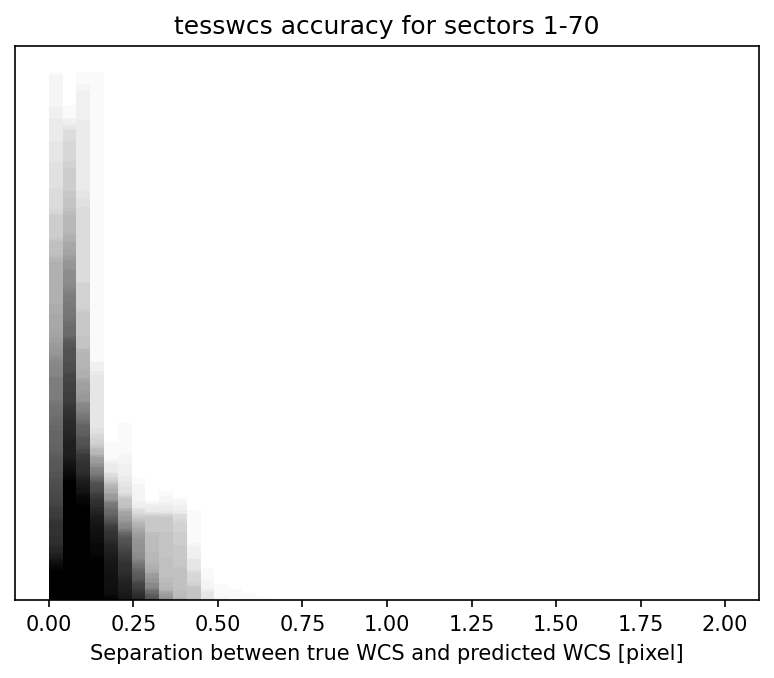

# About `tesswcs`

`tesswcs` is available to help make understanding what sources will fall on which pixels in the TESS focal plane. This two works by taking the archival WCS of TESS and using them to create a general WCS solution. `tesswcs` then can apply this general solution to any RA, Dec, and Roll of the boresight of the telescope, to predict the WCS is any given pointing. 

## How do you find the WCS?

`tesswcs` relies on `tessrip` to access the TESSCut datacubes stored by MAST at AWS. These cubes contain within them the WCS solution for every FFI taken with TESS. `tessrip` downloads and averages the WCS solutions for every FFI in a given sector, camera, and CCD and averages them. `tesswcs` then uses these averages to calculate a general solution which works for any pointing.

## What are the exact steps to find the WCS?

To find the WCS we first find the average separation and position angle between the boresight and the center of the CCDs. This is averaged over all sectors to get an accurate answer. We then find the separation and position angles of the four corners of each of the CCDs with respect to the CCD center. We also take the average [SIP coefficients](https://docs.astropy.org/en/stable/wcs/note_sip.html) to capture the average optical distortions. 

To predict a WCS, we take an RA, Dec, and roll, and then 1. translate the boresight to that coordinate 2. translate the CCD centers to be relative to this point 3. translate the CCD corners to be relative to this point. We then fit to find the best PC matrix to transform pixel coordinates to these corners. 

We additionally find a "warp" that is applied to the PC matrix solution, to best fit the TESS data. This warp is fit by calculating the average best fit warp when comparing predicted WCS to true, measured WCS.

## How accurate is `tesswcs`?

When comparing the predicted WCS to the true, measured WCS for archival data, we find that `tesswcs` predictions are always accurate to within 1 pixel of the true WCS. The figure below shows the separation between the true WCS and predicted WCS for sectors 1 through 70 of TESS data.

